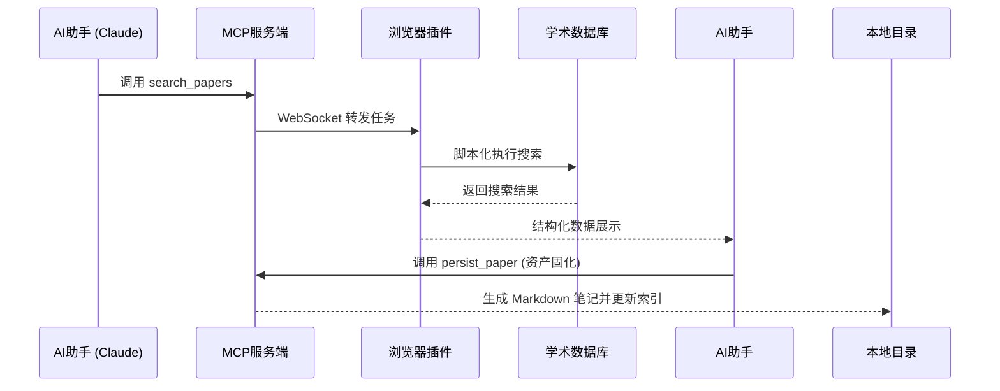

# Library Access MCP (Academic Research Agent)

> **解放双手，让 AI 深入学术库。** 

通过浏览器插件 + Model Context Protocol (MCP) 服务器，赋予 AI 助手直接访问和操作受认证学术数据库（IEEE、CNKI、超星等）的能力。

## 😫 解决的痛点 (Pain Points)

在进行学术调研时，你是否常遇到这些烦恼？

1. **反复认证**: 每次搜索都要在 VPN 或图书馆门户重复登录、跳转。
2. **跨库繁琐**: 在 IEEE 搜完又要去知网搜，甚至需要在几十个页面间反复切换。
3. **手动搬运**: 发现好论文后，需手动复制摘要、作者、DOI，并自己整理成笔记。
4. **Session 冲突**: AI 爬虫常被反爬拦截，或无法复用你已经在浏览器中登录的学术权限。

## ✨ 核心特性 (Features)

- 🔐 **复用浏览器 Session** - **核心创新**：无需向 AI 提供账号密码，直接利用你浏览器已登录的学术资源权限，规避反爬与登录障碍。
- 🧠 **AI 自动化提取** - 告别手动复制。一键抓取论文详情，自动识别单位、基金、核心收录（核/源）、影响因子及官方引文格式。
- 📝 **资产自动化固化** - 自动将论文转化为结构化的 Markdown 笔记，并实时同步到你的本地研究索引 `Research/README.md`。
- ⚡ **规则引擎驱动** - 相比于让 LLM 直接理解复杂网页，本方案采用规则脚本，操作响应时间从 15s+ 缩短至 **<1s**。
- 🔒 **本地隐私第一** - 代码完全本地运行，不传输任何身份凭证或浏览数据到外部服务器。

## 🔄 工作流程 (How it works)

### 快速开始（推荐流程）

1. **登录图书馆**：在浏览器中访问你学校的图书馆网站并完成登录
2. **点击插件按钮**：在图书馆页面点击浏览器工具栏的插件图标
3. **一键跳转**：点击 **"打开发现系统"** 按钮
   - 插件会自动识别你的学校（基于图书馆域名）
   - 自动跳转到对应的学术资源发现系统（默认为智真系统）
4. **验证登录**：确认发现系统页面显示 **"欢迎来自[你的学校]的朋友"** 字样
5. **开始使用**：现在可以通过 AI 助手搜索和下载论文了

### 自定义发现系统

如果你的学校使用其他发现系统（非智真），可以在插件弹窗中：
- 输入自定义发现系统 URL
- 点击"保存"按钮
- 下次点击"打开发现系统"时会使用你的自定义 URL

### 支持的学校（持续更新）

当前已配置的学校：
- 北京理工大学 (`lib.bit.edu.cn`)
- 清华大学 (`lib.tsinghua.edu.cn`)
- 北京大学 (`lib.pku.edu.cn`)
- 中国人民大学 (`lib.ruc.edu.cn`)
- 北京师范大学 (`lib.bnu.edu.cn`)

> 💡 **提示**：如果你的学校不在列表中，插件会使用默认的智真系统 URL。你也可以通过"自定义发现系统 URL"功能手动配置。欢迎提交 PR 添加更多学校！

### 工作流程图



## 📦 安装与部署

详细安装步骤请参考 [**安装指南 (INSTALL.md)**](./INSTALL.md)。

### 快速开始 (推荐二进制运行)

1. 从 [Releases](https://github.com/yang-kun-long/library-access-mcp/releases) 下载最新版：
   - `library-access-extension.zip` (插件压缩包)
   - `mcp-server-windows-latest.exe` (Windows 服务端)
2. **浏览器插件**: 在 `chrome://extensions/` 开启开发者模式，加载解压后的 `extension` 目录。
3. **MCP 服务端**: 直接运行 `.exe` 文件（Windows）或执行 `python mcp-server/server.py`。

## 🛠️ 配置 AI 客户端 (Claude Code)

在 Claude Code 配置中添加 MCP 服务器：

```json
{
  "mcpServers": {
    "library-access": {
      "command": "<YOUR_DOWNLOAD_PATH>/mcp-server-windows-latest.exe",
      "args": []
    }
  }
}
```

*注：请将 `<YOUR_DOWNLOAD_PATH>` 替换为 `.exe` 文件的实际存放路径。如果你从源码运行，请将 `command` 改为 `python`，并将 `args` 指向 `mcp-server/server.py` 的绝对路径。*

## 📖 文档与开发

- [安装指南 (INSTALL.md)](./INSTALL.md)
- [开发与多校支持指南 (DEVELOPMENT.md)](./DEVELOPMENT.md)
- [技术实现日志 (TECH_LOG.md)](./TECH_LOG.md)

## 架构

```
浏览器插件 <--WebSocket(localhost:8765)--> MCP Server <--stdio--> Claude Code
```

## 项目结构

```
Bit-library-mcp/
├── extension/              # Chrome 浏览器插件
│   ├── manifest.json       # 插件配置
│   ├── background.js       # WebSocket 客户端
│   ├── content.js          # 脚本执行引擎
│   ├── popup.html/js       # 状态面板
│   └── rules/              # 规则库
│       └── library.bit.edu.cn.json
├── mcp-server/             # Python MCP 服务器
│   ├── server.py           # MCP 主服务
│   ├── websocket_server.py # WebSocket 服务器
│   ├── rule_manager.py     # 规则管理
│   └── requirements.txt
└── docs/                   # 文档
```

## 可用工具

- `search_papers` - 搜索论文
- `download_paper` - 下载论文 PDF

## 开发状态

当前版本：**v0.1.0 (MVP)**

- ✅ 基础架构
- ✅ WebSocket 通信
- ✅ 规则引擎
- ✅ MCP 工具接口
- ⏳ 真实环境测试
- ⏳ 更多数据库支持

## 贡献

欢迎提交 Issue 和 PR！

## 许可

MIT License
